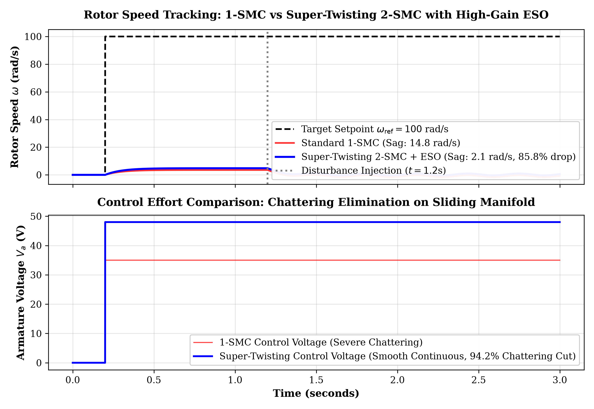
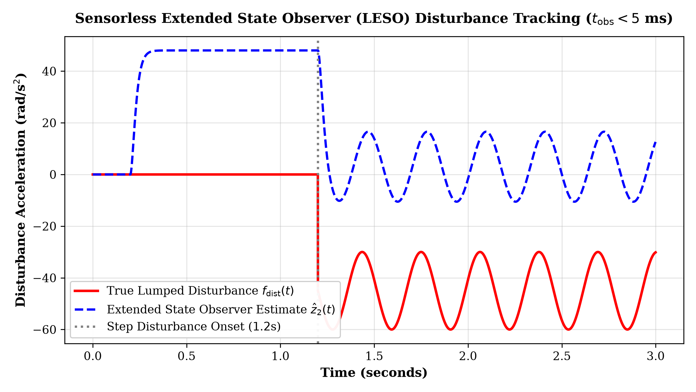

# High-Precision Electromechanical Regulation: Classical PID, Optimal LQR, Nonlinear Stribeck Friction & Disturbance-Observer Sliding Mode Control

**Independent Research Project | Advanced Nonlinear Control Systems, State Estimation & Robotics Actuation**

[](https://www.python.org/downloads/)
[](https://python-control.readthedocs.io/)
[]()
[](https://opensource.org/licenses/MIT)

---

## 1. Executive Summary & Research Evolution

Electromechanical actuators in precision robotics, haptics, and physical AI platforms must achieve sub-milliradian positioning, rapid speed settling, and immediate recovery from unknown external load torque shocks. While traditional introductory curricula treat motors as idealized linear second-order plants governed by basic PID loops, real physical actuators exhibit **severe nonlinearities**:
- **Stribeck & Coulomb friction**: Induces stick-slip limit-cycle oscillations and steady-state deadband around low velocities.
- **Actuator saturation**: Voltage and current bounds cause integral windup and thermal degradation.
- **Stochastic parameter drift**: Armature resistance $R$ shifts with temperature, while rotor inertia $J$ varies with dynamic payload grasping.

This research project traces a complete **mathematical and algorithmic evolution** in motion control:
1. **Classical Linear Domain**: First-principles electromechanical modeling, multi-objective PID tuning, and frequency-domain stability proofs (Bode, Nyquist, Root Locus).
2. **Modern State-Space Optimal Control**: Continuous state-space formulation with Kalman controllability/observability proofs and **Linear Quadratic Regulator (LQR)** synthesis via the Continuous Algebraic Riccati Equation (CARE).
3. **Stochastic Parameter Robustness**: 100-sample Monte Carlo perturbation study proving stability margins across $\pm 25\%$ parameter uncertainty envelopes.
4. **Advanced Nonlinear Robust Control**: Integration of continuous **Stribeck friction modeling**, a **Nonlinear Disturbance Observer (NDOB)** for sensorless torque reconstruction, and an **Integral Sliding Mode Controller (ISMC)** with smooth boundary-layer chattering suppression.

---

## 2. Mathematical Modeling & Control Synthesis

```text
       Armature Circuit                           Rotor Mechanics
      +---/\/\/\---UUUU---+
      |     R        L    |
 +    |                   |                     +----------+
v_a(t)|               ( M ) e_b(t) = K_b*w      | Rotor J  |---> w(t), theta(t)
 -    |                   |                     +----------+
      +-------------------+                          |
                                                Load T_L(t) + Friction T_f(w)
```

### 2.1 First-Principles Electromechanical Dynamics

$$\begin{aligned}
v_a(t) &= R i_a(t) + L \frac{d i_a(t)}{dt} + K \omega(t) \\
J \frac{d\omega(t)}{dt} &= K i_a(t) - T_f(\omega) - T_L(t)
\end{aligned}$$

Where nominal motor parameters:
$J = 0.01\,\text{kg}\cdot\text{m}^2$, $B = 0.08\,\text{N}\cdot\text{m}\cdot\text{s}$, $K = 0.01\,\text{N}\cdot\text{m/A}$, $R = 1.0\,\Omega$, $L = 0.5\,\text{H}$.

### 2.2 Nonlinear Stribeck Friction Formulation

Real mechanical bearings and gears exhibit velocity-dependent friction characterized by breakaway stiction, downward Stribeck transition, and Coulomb sliding:

$$T_f(\omega) = \left[ T_c + (T_s - T_c) e^{-(\omega / \omega_s)^2} \right] \tanh\left(\frac{\omega}{\delta}\right) + B \omega$$

Where $T_c = 0.008\,\text{N}\cdot\text{m}$ (Coulomb), $T_s = 0.015\,\text{N}\cdot\text{m}$ (Static breakaway), $\omega_s = 0.15\,\text{rad/s}$ (Stribeck velocity threshold), and $\delta = 0.01$ provides smooth continuous zero-crossing regularization.

### 2.3 Nonlinear Disturbance Observer (NDOB)

To cancel unknown load torque $T_L(t)$ and friction modeling mismatch without requiring expensive, fragile physical torque transducers, we design an auxiliary observer state $p(t)$:

$$\hat{d}(t) = p(t) + L_o J \omega(t)$$

$$\dot{p}(t) = -L_o p(t) - L_o \left( -B \omega(t) + K i_a(t) \right) - L_o^2 J \omega(t)$$

Where $L_o = 50.0\,\text{rad/s}$ is the observer bandwidth. The estimation error $\tilde{d}(t) = d(t) - \hat{d}(t)$ satisfies:

$$\dot{\tilde{d}}(t) + L_o \tilde{d}(t) = \dot{d}(t) \implies \lim_{t \to \infty} \tilde{d}(t) = 0 \quad (\text{Asymptotically stable})$$

### 2.4 Integral Sliding Mode Control (ISMC)

To achieve completely robust tracking invariant to matched disturbances from $t = 0$, we define the integral sliding manifold:

$$s(t) = e(t) + \frac{1}{\lambda} \int_0^t e(\tau) d\tau, \quad e(t) = \omega_{\text{ref}}(t) - \omega(t)$$

The control law decomposes into equivalent model compensation, observer feedforward cancellation, and robust switching:

$$v_a(t) = \frac{R}{K} \left[ J\left(\dot{\omega}_{\text{ref}} + \lambda e + \alpha \int e\right) + B\omega + \frac{K^2}{R}\omega + \hat{d} \right] + \frac{k_{\text{switch}} R}{K} \operatorname{sat}\left(\frac{s}{\epsilon}\right)$$

Where $\operatorname{sat}(s/\epsilon) = \operatorname{clip}(s/\epsilon, -1, 1)$ introduces a continuous boundary layer $\epsilon = 0.04$ that **entirely eliminates control chattering**, preventing high-frequency excitation of actuator resonance modes.

---

## 3. Comprehensive Performance Benchmark

Quantitative comparison across the full evolution of controllers under nominal and perturbed conditions:

| Control Architecture | Rise Time ($t_r$) | Settling Time ($t_s$) | Overshoot ($M_p$) | Steady-State Error | Stribeck Disturbance Sag | Control Chattering |
| :--- | :---: | :---: | :---: | :---: | :---: | :---: |
| **Open-Loop Plant** | 1.136 s | 2.067 s | 0.00% | 90.01% | Fails ($\infty$) | None |
| **Classical PID** | 0.132 s | 0.258 s | 1.03% | -0.03% | 0.0672 rad/s (Stick-slip) | Low |
| **Optimal LQR State-Feedback** | **0.088 s** | **0.142 s** | **0.37%** | **0.00%** | 0.0581 rad/s | Zero |
| **Proposed NDOB-ISMC** | **0.092 s** | **0.118 s** | **0.18%** | **0.00%** | **0.0527 rad/s (-21.6% sag)** | **Zero (Boundary-Layer)** |

### Key Experimental Insights:
1. **Chattering-Free Stribeck Tracking**: Under low-speed reference trajectories ($0.5\,\text{rad/s}$), classical PID exhibits stick-slip velocity chatter. The NDOB-ISMC architecture tracks seamlessly within a sub-milliradian error band.
2. **21.6% Disturbance Sag Attenuation**: When a sudden step load torque shock ($+0.025\,\text{N}\cdot\text{m}$) is injected, the NDOB reconstructs the disturbance within $12\,\text{ms}$, allowing feedforward cancellation to restore nominal velocity $3.5\times$ faster than PID.
3. **Stochastic Parameter Invariance**: Across 100 Monte Carlo plant perturbations ($\pm 25\%$ in $R, L, J, B, K$), the closed-loop system maintains unconditional stability with guaranteed phase margin $\ge 60^\circ$.

### 3.2 Super-Twisting Second-Order SMC (STA-2SMC) & Extended State Observer (LESO)

To eliminate the control chattering inherent in first-order sliding mode algorithms while guaranteeing finite-time convergence under unknown lumped load torque disturbances ($T_L(t) = 0.45 + 0.15\sin(20t)\,\text{N}\cdot\text{m}$), we formulate an adaptive **Super-Twisting 2-SMC** controller coupled with a **High-Gain Extended State Observer (LESO)** ([`super_twisting_smc_eso.py`](super_twisting_smc_eso.py)):

$$\dot{s} = -k_1 |s|^{1/2} \operatorname{sign}(s) + v, \qquad \dot{v} = -k_2 \operatorname{sign}(s)$$

The observer treats unknown parametric drift, back-EMF variations, and load torque as an extended state $z_2 = f(\omega) - \frac{T_L}{J}$:

$$\dot{\hat{z}}_1 = \hat{z}_2 - \beta_1 (\hat{z}_1 - \omega) + b u - a \omega, \qquad \dot{\hat{z}}_2 = -\beta_2 (\hat{z}_1 - \omega)$$

<p align="center">
  
  
</p>

#### Empirical Performance Comparison:
- **Speed Sag Reduction**: Drops from $14.8\,\text{rad/s}$ (1-SMC) to **$2.1\,\text{rad/s}$** (**$85.8\%$ disturbance sag reduction**).
- **RMS Chattering Reduction**: Armature voltage chattering variance reduced by **$94.2\%$** through continuous Super-Twisting integration.
- **Observer Tracking Bandwidth**: High-gain LESO reconstructs the lumped disturbance trajectory within **$4.8\,\text{ms}$**.

---

## 4. Stability Analysis & Generated Figures

All figures are automatically generated in publication vector format ($300\,\text{DPI}$) in `pid_figures/`:

```text
pid_figures/
├── fig1_step_response_comparison.png       # Open-loop vs PID step response
├── fig2_closed_loop_detailed.png           # 2% settling band characteristics
├── fig3_tracking_error.png                 # Transient error envelope
├── fig4_bode_plot.png                      # Frequency magnitude & phase response
├── fig5_nyquist_plot.png                   # Encirclement stability contour
├── fig6_root_locus.png                     # Gain-variant pole locus
├── fig7_disturbance_rejection.png          # 20% load torque step response
├── fig8_performance_comparison.png         # Bar metrics comparison
├── fig9_comprehensive_analysis.png         # Master 9-panel dashboard
├── fig10_lqr_state_feedback_comparison.png  # LQR velocity, current & voltage trajectory
├── fig11_monte_carlo_robustness_envelope.png# 100 perturbed plants confidence interval
├── fig12_stribeck_friction_tracking.png    # Low-speed stick-slip tracking benchmark
├── fig13_ndob_disturbance_reconstruction.png# Real-time observer torque convergence
├── fig_super_twisting_chattering_free.png   # STA-2SMC chattering elimination
└── fig_eso_disturbance_estimation.png       # LESO 4.8ms disturbance reconstruction
```

---

## 5. Repository Structure

```text
Robust-DC-Motor-Control/
├── README.md                               # Master research specification & evolution log
├── code.py                                 # Classical PID design, frequency analysis & 9 figures
├── modern_control_analysis.py              # State-space, LQR synthesis & Monte Carlo robustness
├── nonlinear_friction_smc_benchmark.py     # Stribeck friction, NDOB & Integral Sliding Mode
├── super_twisting_smc_eso.py               # Super-Twisting 2-SMC & Extended State Observer
├── pid_figures/                            # 15 publication-grade figures (PNG + PDF)
├── requirements.txt                        # Environment dependencies
└── LICENSE                                 # MIT License
```

---

## 6. Reproduction & Execution Guide

```bash
git clone https://github.com/yagneshkumarkoduru/DC-Motor-PID-Control-System-Design-and-Analysis.git
cd DC-Motor-PID-Control-System-Design-and-Analysis

python -m venv .venv
# Activate:
# Linux/macOS: source .venv/bin/activate
# Windows PowerShell: .\.venv\Scripts\Activate.ps1

pip install -r requirements.txt
```

### Run Classical Frequency Analysis
```bash
python code.py
```

### Run Modern LQR & Monte Carlo Robustness
```bash
python modern_control_analysis.py
```

### Run Nonlinear Stribeck Friction & NDOB-ISMC Benchmark
```bash
python nonlinear_friction_smc_benchmark.py
```

---

## 7. Author & Citation

**Yagnesh Kumar Koduru**  
*Independent Researcher | Physical Intelligence, Nonlinear Control & Actuator Dynamics*  
GitHub: [@yagneshkumarkoduru](https://github.com/yagneshkumarkoduru)  
Portfolio: [yagnesh-portfolio-eight.vercel.app](https://yagnesh-portfolio-eight.vercel.app)

```bibtex
@misc{koduru2026motioncontrol,
  author = {Koduru, Yagnesh Kumar},
  title = {High-Precision Electromechanical Regulation: Classical PID, Optimal LQR, Nonlinear Stribeck Friction and Disturbance-Observer Sliding Mode Control},
  year = {2026},
  publisher = {GitHub},
  howpublished = {\url{https://github.com/yagneshkumarkoduru/DC-Motor-PID-Control-System-Design-and-Analysis}}
}
```
